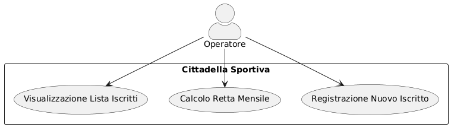
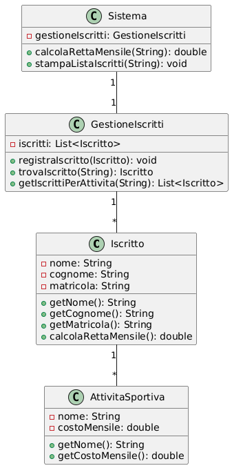

# Software Requirements Specification (SRS)
## Gestione Cittadella Sportiva Universitaria

### Informazioni Studente
- Nome: Luigi
- Cognome: Rosato
- Matricola: IN32000141
- Data Appello: 16.06.2025

### 1. Introduzione
Questo documento specifica i requisiti per un sistema di gestione di una cittadella sportiva universitaria. Il sistema permetterà la gestione degli iscritti e delle attività sportive offerte.

### 2. Descrizione Generale
Il sistema gestisce una cittadella sportiva universitaria che offre tre attività sportive principali:
- Nuoto (€25,00 mensili)
- Atletica leggera (€40,00 mensili)
- Body building (€50,00 mensili)

Gli utenti possono iscriversi a una o più attività sportive, e il sistema deve gestire le registrazioni e i costi associati.

### 3. Requisiti Specifici

#### 3.1 Requisiti Funzionali
1. Registrazione iscritti con:
   - Nome
   - Cognome
   - Matricola
   - Attività sportive praticate

2. Calcolo retta mensile:
   - Input: matricola
   - Output: costo totale mensile
   - Gestione errore per matricola non presente

3. Gestione iscrizioni:
   - Possibilità di iscriversi a più attività
   - Visualizzazione lista iscritti per attività

#### 3.2 Requisiti Non Funzionali
1. Interfaccia grafica desktop
2. Sistema monoutente (unica sede)
3. Performance: risposta immediata alle query

### 4. Diagramma dei Casi d'Uso

### 5. Descrizione Testuale dei Casi d'Uso

#### UC1: Registrazione Nuovo Iscritto
- **ID**: UC1
- **Attori**: Operatore
- **Precondizioni**: Nessuna
- **Sequenza principale**:
  1. Operatore inserisce nome e cognome
  2. Operatore inserisce matricola
  3. Operatore seleziona le attività sportive
  4. Sistema salva i dati
- **Sequenze alternative**:
  1a. Matricola già esistente: sistema mostra errore
- **Postcondizioni**: Nuovo iscritto registrato nel sistema

#### UC2: Calcolo Retta Mensile
- **ID**: UC2
- **Attori**: Operatore
- **Precondizioni**: Sistema contiene iscritti registrati
- **Sequenza principale**:
  1. Operatore inserisce matricola
  2. Sistema calcola costo totale
  3. Sistema mostra importo
- **Sequenze alternative**:
  1a. Matricola non trovata: sistema mostra warning
- **Postcondizioni**: Visualizzazione costo mensile

#### UC3: Visualizzazione Lista Iscritti per Attività
- **ID**: UC3
- **Attori**: Operatore
- **Precondizioni**: Sistema contiene iscritti registrati
- **Sequenza principale**:
  1. Operatore seleziona attività sportiva
  2. Sistema mostra lista iscritti
- **Postcondizioni**: Visualizzazione lista iscritti

### 6. Diagramma delle Classi di Analisi

### 7. Vincoli di Progetto
- Sistema desktop
- Unica sede di utilizzo
- Nessun requisito di connessione remota

### 8. Altri Requisiti
- Interfaccia grafica intuitiva
- Backup dati giornaliero
- Log delle operazioni 