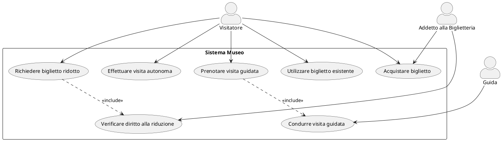
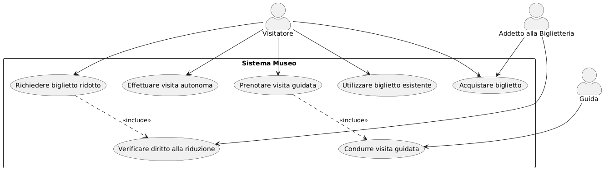
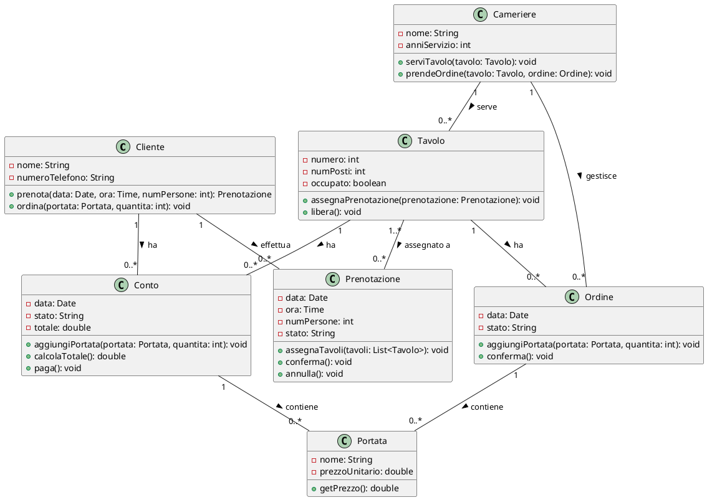
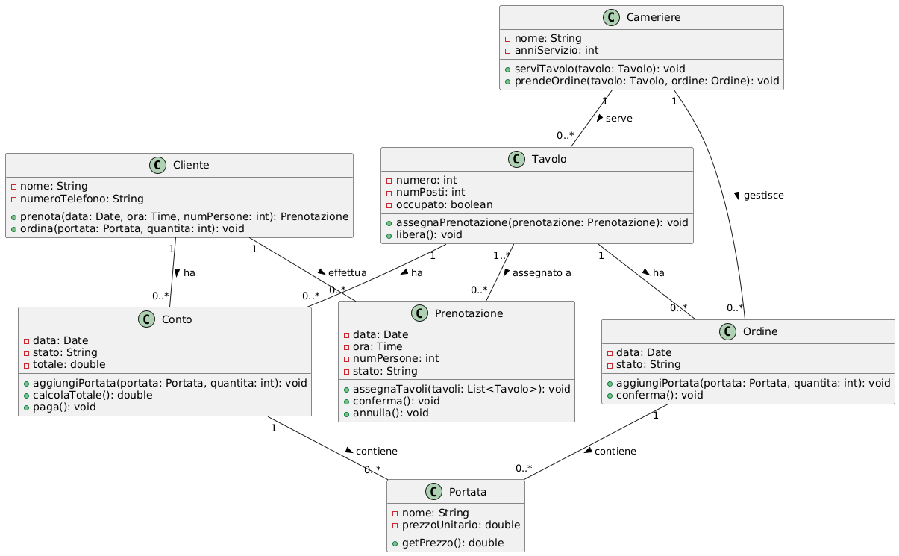

# Esame di Ingegneria del Software

## Esercizio 1: Sistema Museo

### Testo dell'esercizio
Si consideri il seguente sistema Museo:
- Gli utenti possono visitare il museo, comprando un biglietto venduto da un addetto alla biglietteria o usando biglietti acquistati precedentemente;
- La visite avvengono da soli oppure con una guida;
- Alcune categorie di visitatori hanno diritto ad un biglietto ridotto, previa dimostrazione dell'applicabilità della riduzione.

### Codice PlantUML

### Diagramma dei Casi d'Uso

## Esercizio 2: Sistema Ristorante

### Testo dell'esercizio
Rappresentare il seguente testo tramite un diagramma UML delle classi di progettazione, prevedendo eventuali attributi e metodi con la relativa visibilità:
- In un ristorante sono entità di interesse i clienti, i tavoli (con il relativo numero di posti), le prenotazioni (effettuate dai clienti per un certo giorno ed ora, ed un certo numero di persone) alle quali viene assegnato uno o più tavoli, i camerieri (che servono i clienti al tavolo) ed i conti relativi ai vari tavoli (contenenti i prezzi delle singole portate ordinate, e le loro quantità). Dei clienti interessa il nome e numero di telefono, mentre dei camerieri interessa nome e anni di servizio. Infine delle portate interessa il nome ed il prezzo unitario.

### Codice PlantUML

### Diagramma delle Classi

